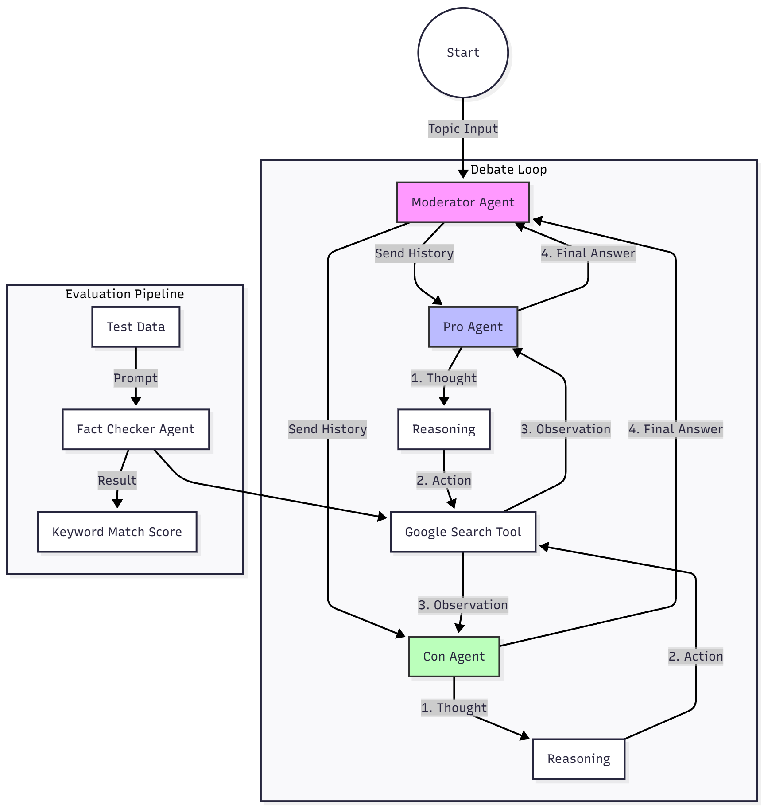

# DebateBot: Autonomous Fact-Checking AI Agent 🤖

## 🏆 Kaggle Agents Intensive Capstone Project

**DebateBot** is a multi-agent system designed to conduct autonomous debates. It uses a "Pro" agent and a "Con" agent that research topics in real-time using Google Search, reason through arguments, and rebut each other, all overseen by a Moderator.

### 🏗️ Architecture

The system utilizes the **ReAct (Reasoning + Acting)** pattern:
1.  **Think:** Analyze the opponent's argument.
2.  **Act:** Query the Google Search tool for evidence.
3.  **Observe:** Process search results.
4.  **Reply:** Generate a fact-based rebuttal.

### 🛠️ Tech Stack
* **Framework:** Google Agent Development Kit (ADK)
* **Model:** Gemini 2.0 Flash
* **Tools:** Google Search
* **Evaluation:** Custom AgentEval pipeline with Keyword Matching

### 🚀 How to Run
1.  Clone the repo.
2.  Install dependencies: `pip install -r requirements.txt`
3.  Set your `GOOGLE_API_KEY` in your environment.
4.  Open `DebateBot.ipynb` in Jupyter or VS Code.
5.  Run all cells.

---
*Created by [Mohammed Ayaan Hyder]*
